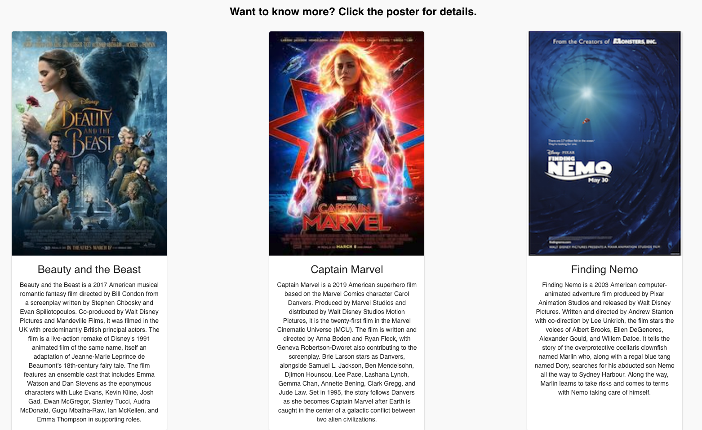
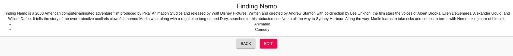
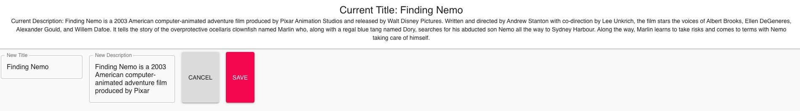

# Saga Movie Database

## Description
*Two Day Sprint*

This application contains a list of films that includes the movie poster, title, and description of relevant film details. Users can click on a movie to see additional details, and can even edit a movie's title or description.

## Screen Shot

## Prerequisites 
- Node.js
- React
- Redux
- Axios
- Postgres

## Installation
1. Create a database named `saga_movies_weekend`,
2. There are queries in the `database.sql` file that will create and add data to all required tables for this app. It is recommended to use Postico for running these queries,
3. Open your code editor of choice and run `npm install`,
4. Run `npm run server` in your terminal,
5. Open a second terminal and run `npm run client`,
6. The previous command will open the app in a browser for you to use.

## Usage
1. The home page contains the list of all movies in the database. For details on any particular movie, please click the movie poster.
2. The Details page provides the movie title and description. If you wish to change either or both of these details, click the `Edit` button.
3. The Edit page displays the current movie title and description, as well as a form to update both. If you decide not to edit, click the `Cancel` button.
4. Otherwise, once you have updated the title and/or description as desired, click the `Save` button to update and return to the Details page.

## Built With
- React
- Redux
- JavaScript
- Material UI

## Acknowledgement
Thanks to Prime Digital Academy for providing me the education to make this app possible. Thanks as well to the Dijkstra cohort for their support and encouragement.

## Support
For suggestions or issues, please contact me at aescott87@gmail.com
